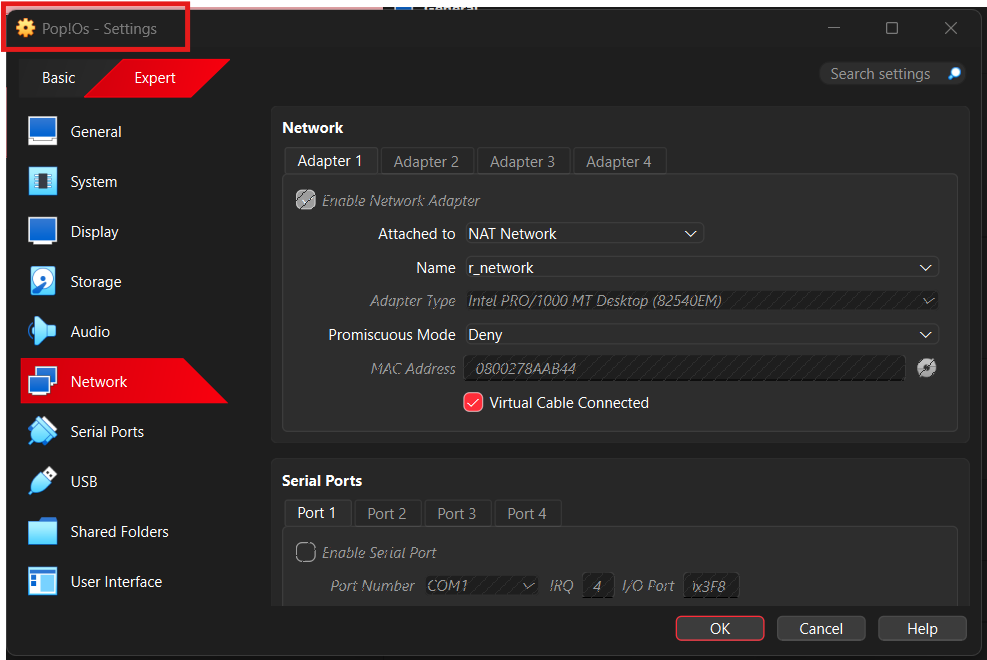
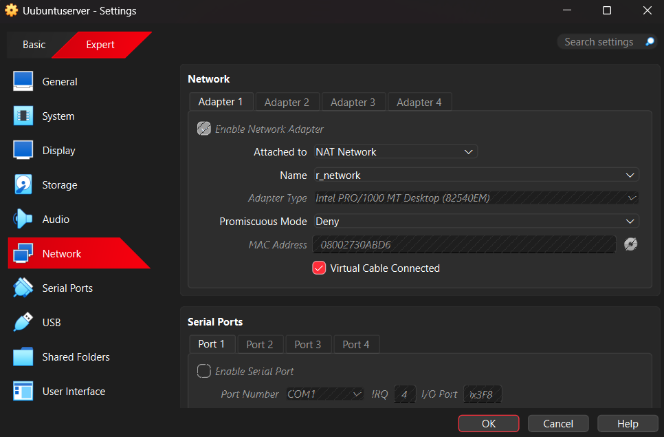
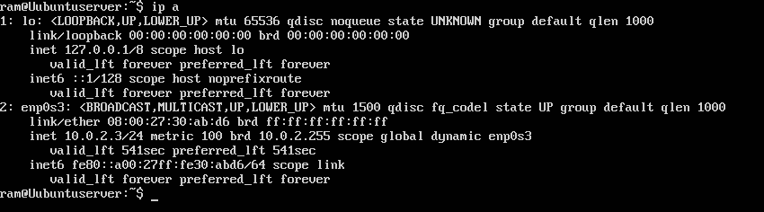
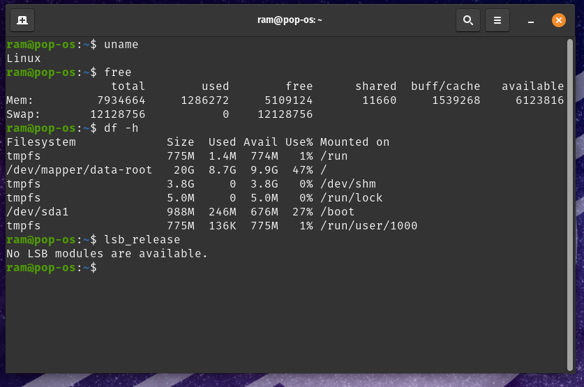

# Operating System Week 1.

## Distribution Selection 

### 1. Workstation : Pop!_OS
### 2. Server : Ubuntu server 

## Distribution Selection Justification

I have selected a Debain-based distribution. My primary motivation was to choose a platform that is very stable, reliable and beginner friendly. It uses apt package manager which make it easy for us to find and install almost any open-source software. Most of the open-source softwares are tested and released for apt first. The debain family is also backed by many documentation online which can be used if I get stuck during installation or any other system errors.

## Comparison with Other Alternatives

There are also other alternatives which belongs to Red Hat , I did not choose this distribution because most of these OS are designed for enterprise level which is not free to use and it also uses different package manager called dnf which is not beginner friendly.

SUSE family was also in the option but it is also very widely used in enterprise-level server and it uses RPM package system which has less number of software support compared to apt. 

## System Architecure Diagram

NOTE : IP information about Windows host has not been displayed because of security reasons.

## Workstation Configuration 

Workstation Choice : Pop!_OS with 8 GB RAM, 4 Cores.

Justification : I chose Pop!_OS because it is based on Ubuntu and it shares the same package manager as my ubuntu server which makes it easy to seamlessly interact with both OS. It is optimized for performance and  supports NVIDIA drivers out of the box. This configuration with 8GB RAM and 4 cores, is sufficient for development, gaming and multitasking, while remaining stable and user-friendly, and productive.

## Network Configuration Documentation

**VirtualBox NAT Network Settings:**  
- Both **Pop!_OS** (workstation) and **Ubuntu Server** are connected to the same NAT Network named **r_network**.  
- Adapter 1 on both VMs is set to **NAT Network** with the "Cable connected" option enabled.  
- Using a NAT Network allows automatic IP assignment via VirtualBox DHCP while providing internet access for updates and package installation.

**IP Addressing:**  
- Both VMs receive IP addresses automatically from the **r_network DHCP server**.  
- Example IP assignments:

| VM            | IP Address       | Subnet Mask       | Gateway   |
|---------------|----------------|-----------------|---------------|
| Pop!_OS       | 10.0.2.15      | 255.255.255.0   | 10.0.2.1      |
| Ubuntu Server | 10.0.2.3       | 255.255.255.0   | 10.0.2.1      |

**Connectivity Verification:**  
 ## IP addresses in both machines : 

 ### Ubuntu server :

## Ping test to Desktop:

### Pop!OS : 

## Ping test to Server: 

## Linux command documentation (uname, lsb_release, free, df -h, ip addr )

## Ubuntu : 

## Pop!OS : 

